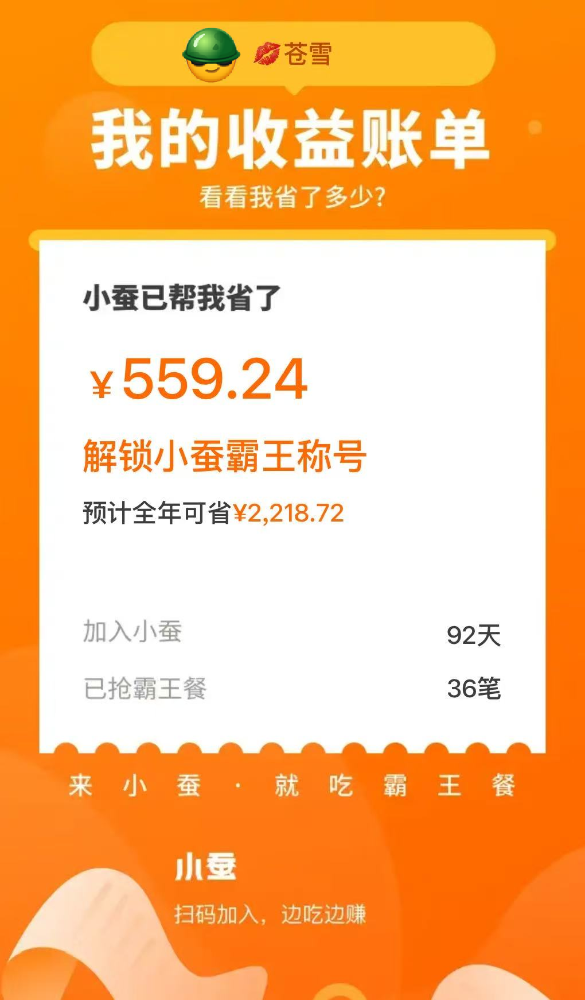
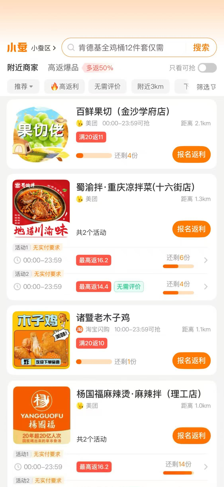
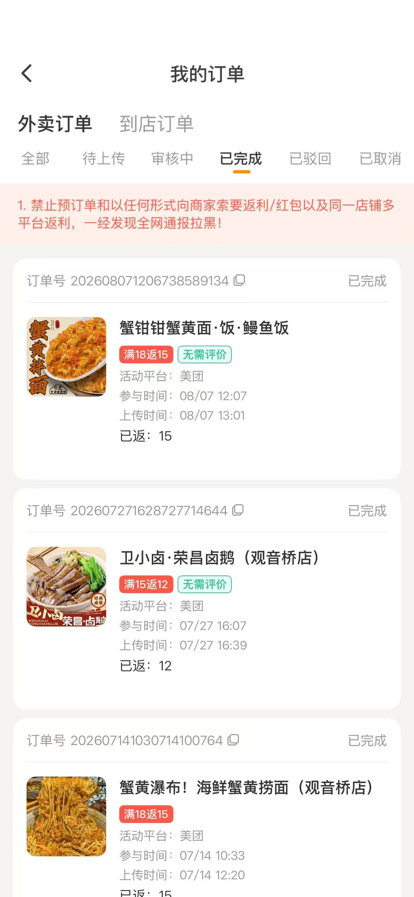
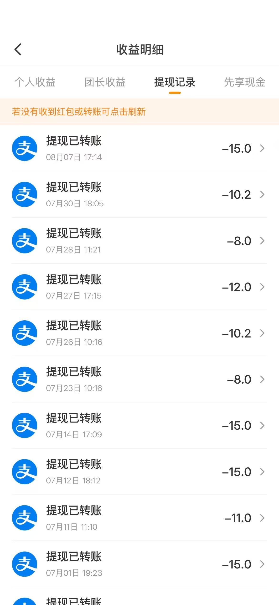

你有没有算过，一个月在吃上面要花多少钱？

外卖一顿二三十，到店消费动辄五六十，月底一看账单——工资没涨多少，饭钱倒是先涨了。

**今天就给大家分享一个我亲测了3个月的「免费吃饭」神器：小蚕推广返利平台。**

写个真实评价就能全额返现，一顿外卖钱都不用花，真正的霸王餐吃到爽。

> 📖 看完想立即上手？请跳转：[小蚕霸王餐·详细图文+视频使用教程](/posts/xiaocan-tutorial/)

---

## 一、先上真实数据：我到底省了多少钱？

空口无凭，先给大家看我的真实收益账单：

**加入小蚕92天，累计省下 ¥559.24，已经解锁「小蚕霸王」称号。**

按照这个节奏，**预计全年能省 ¥2218.72**，相当于白吃了两个多月的饭。

一共撸了 **36笔霸王餐**，平均下来两天一顿，连我自己都觉得离谱。而且这还只是我个人用的，邀请好友还有额外奖励。

---

## 二、什么是小蚕推广？它的原理是什么？

简单来说，小蚕推广是一个**帮商家刷订单量和好评的返利平台**。

商家想要提升在外卖平台的排名和销量，就会在小蚕上发布返利活动。用户报名活动后，去对应的外卖店铺正常下单，收到餐之后回到小蚕上传订单截图，平台就会把餐费全额（或高额）返利给你。

**商家得到了真实订单和好评，你得到了免费的一顿饭，双赢。**

平台已经运营8年，服务了千万级用户，返利都是100%真实到账，不是那种虚头巴脑的优惠券。

看看这商家列表——杨国福麻辣烫、百鲜果切、蜀渝拌凉菜、诸暨老木子鸡……奶茶、炸鸡、水果捞、麻辣香锅，你想吃的基本都有。

**👉 想知道完整操作流程？请查看：[图文+视频详细教程](/posts/xiaocan-tutorial/)**

---

## 三、我撸过的那些霸王餐订单

光说不练假把式，看看我这几个月都白嫖了些啥：

随便挑几个说：

| 商家 | 活动 | 实际花费 |
|---|---|---|
| 蟹钳蟹黄面·鳗鱼饭 | 满18返15 | 约 ¥3 |
| 卫小卤·荣昌卤鹅 | 满15返12 | 约 ¥3 |
| 蟹黄瀑布·海鲜蟹黄捞面 | 满18返15 | 约 ¥3 |

这些都是「已完成」的返利订单，钱实实在在到了我的账户。很多订单甚至标注了「无需评价」，连打字都省了。

36笔霸王餐，平均每笔花费3块钱左右，有时候运气好遇到「满25返25」的全额返活动，那就是纯纯的0元白嫖。

**👉 完整四步操作演示（含视频）：[点这里看教程](/posts/xiaocan-tutorial/)**

---

## 四、提现稳不稳？直接看转账记录

最关键的问题来了：返利真的能提现吗？会不会是套路？

直接上我的支付宝提现记录：

随便截几个到账记录：

- 7月1日：¥15.0
- 7月11日：¥11.0
- 7月12日：¥15.0
- 7月14日：¥15.0
- 7月23日：¥8.0
- 7月26日：¥10.2
- 7月27日：¥12.0
- 7月28日：¥8.0
- 7月30日：¥10.2
- 8月7日：¥15.0

每一笔都是「提现已转账」，支付宝实时到账，没有任何套路。我这92天撸了36单，没有一单被驳回，通过率100%。

---

## 五、新用户专属福利：免单卡 + 首单全额返暗号

现在通过我的邀请注册，**新用户双重福利直接领**：

### 🎁 福利一：新用户免单卡

0元就能吃第一顿，相当于白嫖试错。

> 🔥 每天限量1000份，先到先得

### 🎁 福利二：专属暗号·首单全额返（7天有效）

复制下面整段暗号，打开「小蚕霸王餐」小程序或APP，自动识别并激活首单全额返资格：

6w%12523532246&~【新用户首单全额返，7天内有效】复～制到💥小蚕霸王餐💥小程序搜索

> 💡 操作方法：长按上面橙色框内文字 → 复制 → 打开微信搜索「小蚕霸王餐」小程序 → 粘贴发送或自动识别即可激活

### 📱 注册入口

**👉 点击立即注册：[小蚕推广 - 免费吃霸王餐](https://wxmpurl.cn/clOXJo0sScm)**

也可以直接微信扫描上面海报上的二维码，注册后根据提示下载APP或使用小程序就能开始撸了。

**👉 注册完不会用？完整视频+图文教程就在这里：[小蚕霸王餐详细教程](/posts/xiaocan-tutorial/)**

---

## 六、几个注意事项，避免踩坑

虽然这个平台很稳，但还是有几条规矩要遵守，不然可能会被拉黑：

1. ❌ **禁止预订单**：必须是实时下单的外卖，预订明天的单会被驳回
2. ❌ **禁止向商家索要红包**：不要去跟商家说「我是小蚕来的给我返现」，商家和平台是合作关系，你去私戳很容易出问题
3. ❌ **禁止同一店铺多平台返利**：不要同一个订单在好几个返利平台同时提交，一查一个准
4. ✅ **如实写评价**：需要评价的活动就真实写个二三十字，别复制粘贴模板，更不要写恶意差评

---

## 七、最后说几句真心话

说实话，一开始我也以为这种平台是智商税。什么「免费吃饭」「写评价就返现」，听着就像传销。

但是真的自己用了3个月，撸了36顿霸王餐，看着支付宝里一笔笔到账的提现记录，我才敢放心推荐给大家。

它的逻辑其实很简单：商家需要销量和好评来冲排名，与其把钱花在平台的竞价广告上，不如直接让利给真实用户。你帮商家完成一单真实交易，商家把广告费以返利的形式给你，大家各取所需。

**如果你每天都要吃外卖，那这个平台真的能帮你省下一大笔饭钱。** 就算不是每顿都撸，一个月省个两三百块钱，买杯奶茶买件衣服不香吗？

赶紧行动起来，第一顿免费的已经给你准备好了 👇

**👉 [点我注册小蚕，领取免单卡开吃](https://wxmpurl.cn/clOXJo0sScm)**

> 📖 **还不会操作？** 直接看这篇：[小蚕霸王餐·详细图文+视频使用教程](/posts/xiaocan-tutorial/)，每一步都有截图+视频演示，跟着做3分钟就能吃第一顿。

有问题欢迎评论区交流，祝大家都能撸到爽！🍜
