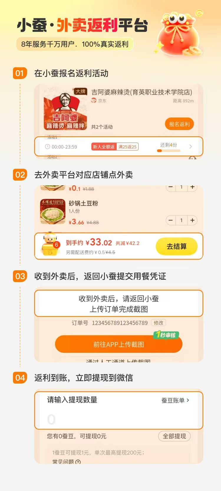

这篇是 **小蚕霸王餐** 的纯使用教程，不含福利宣传内容，只讲操作流程，每一步都有截图+视频+注意事项，跟着做就行。

> 🔥 **还没注册？还没领新用户免单卡和首单全额返暗号？先去这里领福利：[外卖羊毛福利详情·小蚕霸王餐](/posts/takeaway-welfare/)**

---

## 一、先看完整视频演示（约1分钟）

跟着视频做一遍，比读文字更快更直观：

<iframe width="100%" height="468" src="https://player.bilibili.com/player.html?bvid=BV17LgE63E1C&p=1&autoplay=0&high_quality=1&danmaku=0" scrolling="no" border="0" frameborder="no" framespacing="0" allow="accelerometer; autoplay; clipboard-write; encrypted-media; gyroscope; picture-in-picture; web-share" allowfullscreen="true"></iframe>

> 💡 视频无法播放？直接在B站搜索「小蚕霸王餐教程」或访问：[https://www.bilibili.com/video/BV17LgE63E1C/](https://www.bilibili.com/video/BV17LgE63E1C/)
>
> 🔍 若页面空白，刷新一次即可（B站播放器在首次载入时偶发缓存问题）

---

## 二、四步流程总览图

下面这张图是完整流程的一页纸概览，后面我会拆开每一步详细说：

---

## 三、第一步：激活暗号 + 在小蚕报名返利活动

### 3.1 先激活专属暗号（新用户必做）

打开小蚕霸王餐小程序或APP之前，先复制下面整段暗号，打开后会自动识别激活 **首单全额返** 资格（7天内有效）：

6w%12523532246&~【新用户首单全额返，7天内有效】复～制到💥小蚕霸王餐💥小程序搜索

> 💡 操作方法：长按橙色框 → 全部复制 → 打开微信「小蚕霸王餐」小程序 → 自动弹出激活提示

没有激活暗号的新用户只能享受普通返利，激活后第一单 **满多少返多少**，一定要先做这一步！

### 3.2 报名返利活动

1. 打开小蚕APP或小程序，首页会自动定位你附近的商家
2. 每个商家标注了返利金额（如「满20返11」）和剩余名额（如「还剩4份」）
3. 看到想吃的、名额还有的，点 **「报名返利」** 按钮
4. 报名成功后，会提示你在多少时间内完成下单（一般当天23:59前）

> 🕙 **抢名额小技巧：** 早上10:00 和 下午16:00 是平台集中更新活动的时间，高返利的全额返活动最多，建议蹲点。

> 🔗 **还没注册？** [先去福利帖注册+领免单卡](/posts/takeaway-welfare/)

---

## 四、第二步：去外卖平台对应店铺点外卖

报名成功后，页面上会显示「对应店铺名」和「活动平台」（美团 / 饿了么 / 京东外卖 / 淘宝闪购等）。

**严格按照以下要求下单，否则会被驳回：**

1. ✅ 必须是 **报名时显示的那一家店铺**，不能是同名不同店
2. ✅ 下单金额必须 **≥ 活动要求的「满X」金额**（比如满25返25，实付就要≥25元，不含配送费）
3. ✅ 必须是 **即时外卖订单**，不能是预订单、明天达、自取
4. ❌ 不要用会员红包以外的特殊大额优惠券，有时候会判定异常
5. ❌ 不要跟商家提「小蚕」「返利」「返现」任何相关的词

正常下单，正常付款，正常等餐送到，就OK。

---

## 五、第三步：收到外卖后，返回小蚕提交用餐凭证

收到外卖、确认无误后，**当天内** 回到小蚕上传凭证：

1. 打开小蚕 → 点击底部「订单」或「我的 → 我的订单」
2. 找到刚报名的那笔活动，点「上传凭证」
3. 上传 **外卖APP的订单完成截图**（必须能看到订单号、店铺名、实付金额）
4. 手动填写 **订单号**（建议直接复制粘贴，一个数字都不能错）
5. 如有「写评价」要求的，按要求写20~40字真实好评，截图一并上传
6. 点 **「提交审核」**

### 审核时效：

- 大部分「无需评价」的订单：**1秒审核**（系统自动核验）
- 需要写评价的订单：**1~24小时** 人工审核
- 审核结果会在小蚕APP内推送消息，不用守着等

---

## 六、第四步：返利到账，立即提现到微信/支付宝

审核通过后，返利会以 **「蚕豆」** 形式到账。

**兑换比例：1 蚕豆 = 1 元人民币**

### 提现方法：

1. 小蚕APP → 「我的」 → 「我的蚕豆」或「立即提现」
2. 输入要提现的数量（或者直接点「全部提现」）
3. 选择提现到 **支付宝** 或 **微信**（首次需要绑定账号）
4. 确认提交，**几分钟内到账**

### 提现规则：

- ✅ 无门槛，多少都能提
- ✅ 单次最高提现 200 元，每天可以多次提
- ✅ 周末、节假日正常到账
- ❌ 蚕豆有效期一般很长，不用担心过期

---

## 七、常见问题 FAQ

**Q1：报名了但没下单，会有惩罚吗？**
A：不会，就是名额浪费了而已，不会拉黑也不会扣钱。

**Q2：提示「已驳回」怎么办？**
A：看驳回原因。常见的是订单号填错、截图不清晰、金额不够。大部分情况可以修改后重新提交。

**Q3：可以同时用好几个返利平台吗？**
A：同一笔订单 **绝对不能** 同时提交多个平台，一查一个准，会全网拉黑。

**Q4：一定要写好评吗？**
A：活动标签写着「无需评价」的就不用，没写的就要如实写，别写差评，别复制粘贴模板。

**Q5：我邀请朋友有什么奖励？**
A：有团长体系，朋友下单你也有额外返利提成，具体在APP的「邀请好友」页面查看。

---

## 八、从哪开始？

第一步当然是注册+激活暗号+领免单卡 👇

> 🔥 **返回福利帖领取福利：[外卖羊毛福利详情·小蚕霸王餐](/posts/takeaway-welfare/)**

里面有专属注册链接、免单卡二维码、还有我92天省了500多的真实账单，快去开吃第一顿吧！🍜

有任何问题，欢迎在两篇帖子的评论区留言，我都会回复~
